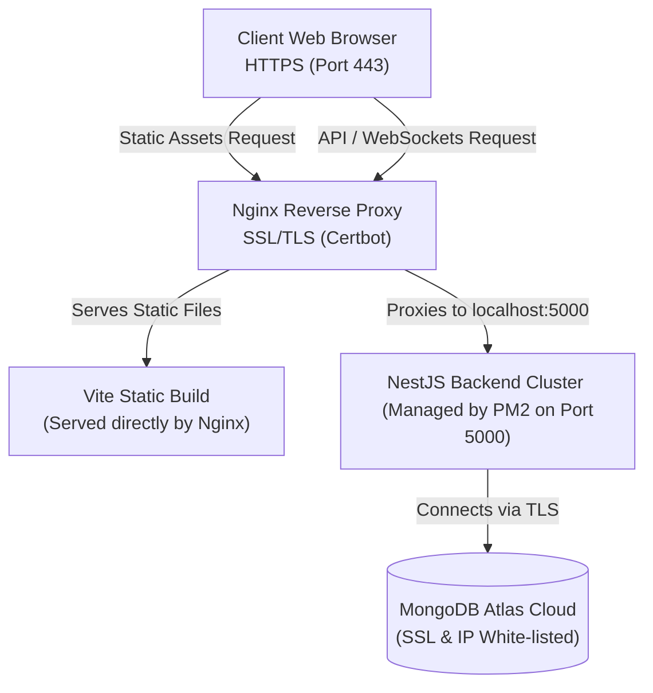

# LegalPro - Multi-Environment Deployment Specification

This guide outlines standard operating procedures for configuring, packaging, and deploying the **LegalPro Case Management System** across multiple operational environments: Development, Staging, and Production.

---

## 1. ⚙️ Environment Variables Matrix

The following table maps the environment variables required across both the React frontend and NestJS backend.

| Scope | Variable Name | Development Value | Staging Value | Production Value |
| :--- | :--- | :--- | :--- | :--- |
| **Frontend** | `VITE_API_URL` | `http://localhost:5000/api` | `https://api-staging.yourdomain.com/api` | `https://api.yourdomain.com/api` |
| | `VITE_SOCKET_URL` | `http://localhost:5000` | `https://api-staging.yourdomain.com` | `https://api.yourdomain.com` |
| | `VITE_GOOGLE_MAPS_API_KEY` | *Sandbox Key* | *Staging Key* | *Production Key* |
| **Backend** | `NODE_ENV` | `development` | `staging` | `production` |
| | `PORT` | `5000` | `5000` | `8000` (or reverse proxied) |
| | `CLIENT_URL` | `http://localhost:5173` | `https://staging.yourdomain.com` | `https://yourdomain.com` |
| | `MONGODB_URI` | `mongodb://127.0.0.1:27017` | `mongodb+srv://staging-db` | `mongodb+srv://production-db` |
| | `JWT_SECRET` | *Testing Secret* | *Secure Managed Secret* | *Highly Encrypted Secret* |
| | `CLOUDINARY_CLOUD_NAME`| *Sandbox Cloud* | *Staging Bucket* | *Production Dedicated Bucket* |
| | `MPESA_ENVIRONMENT` | `sandbox` | `sandbox` | `production` |
| | `MPESA_SHORTCODE` | `174379` (Default Paybill)| `174379` (Sandbox Test) | *Your Commercial Paybill* |

---

## 2. 💻 Development Environment Setup

For local testing and validation of frontend/backend modules:

### Prerequisites:
- **Node.js**: v18.0.0 or higher
- **Package Manager**: npm v9.0.0 or higher

### Local Launch Instructions:
1. **Prepare Directories**:
   Ensure `.env` in the root and `backend/.env` are populated using the development values listed in the matrix.
2. **Launch Backend Server**:
   ```bash
   cd backend
   npm run start:dev
   ```
   *Note: In development mode, the NestJS server automatically launches a local transient `mongodb-memory-server` database instance if it cannot reach external databases, ensuring zero-configuration operation.*
3. **Launch Frontend Client**:
   Open a separate shell terminal in the root folder and run:
   ```bash
   npm run dev
   ```
   Access the client interface locally at [http://localhost:5173](http://localhost:5173).

---

## 🧪 3. Staging Environment Deployment

Staging environments are used to verify code integrations against live sandbox APIs (such as the Safaricom Daraja Sandbox and Cloudinary storage limits) before releasing them to production.

### A. Frontend (React SPA) Staging Deployment via Vercel or Netlify
Because the frontend is a pure client-side Single Page Application, it can be hosted on globally distributed CDNs:

1. **Build the Artifacts locally or in CI**:
   ```bash
   npm run build
   ```
   This generates a static, production-optimized folder `/dist`.
2. **Deploy to Vercel**:
   - Install Vercel CLI: `npm install -g vercel`
   - Run: `vercel`
   - Select your project namespace, link to target repository, and configure the environment variables:
     - `VITE_API_URL` ──► Pointing to your backend staging server URL.
     - `VITE_SOCKET_URL` ──► Pointing to your backend staging root domain.
   - Configure Route Redirection: To support React Router HTML5 pushState routes, add a `vercel.json` file to the root directory containing:
     ```json
     {
       "rewrites": [{ "source": "/(.*)", "destination": "/index.html" }]
     }
     ```

### B. Backend (NestJS API) Staging Deployment via Render or Railway
To run the server instance:

1. **Docker Setup (Optional but recommended)**:
   Create a `Dockerfile` inside `backend/`:
   ```dockerfile
   FROM node:18-alpine AS builder
   WORKDIR /app
   COPY package*.json ./
   RUN npm ci
   COPY . .
   RUN npm run build

   FROM node:18-alpine
   WORKDIR /app
   COPY package*.json ./
   RUN npm ci --only=production
   COPY --from=builder /app/dist ./dist
   EXPOSE 5000
   CMD ["node", "dist/main"]
   ```
2. **Render/Railway Deployment**:
   - Link Render to your GitHub repository.
   - Select **Web Service** type, set compile build command to `npm run build` inside `backend/` and start script to `npm start`.
   - Setup Environment parameters inside Render Dashboard (ensure production MongoDB URI and non-restricted whitelisted Atlas IPs are set).

---

## 🏛️ 4. Production VPS Deployment (Bare Metal / Ubuntu Server)

For optimal performance, control, and secure transactions (such as real-time M-Pesa push triggers and Chat socket channels), deploying to an Ubuntu VPS (such as AWS EC2, DigitalOcean, or Linode) using PM2 and Nginx is the standard approach.



### Phase A: Virtual Machine Initialization & Software Provisioning
Connect via SSH to your clean Ubuntu instance and run:
```bash
# Update local packages
sudo apt update && sudo apt upgrade -y

# Install Node.js runtime (v18 LTS NodeSource distribution)
curl -fsSL https://deb.nodesource.com/setup_18.x | sudo -E bash -
sudo apt-get install -y nodejs

# Verify install
node -v && npm -v

# Install PM2 Process Manager globally
sudo npm install -g pm2

# Install Nginx web server and Certbot
sudo apt install nginx certbot python3-certbot-nginx -y
```

### Phase B: Build & Setup on the Server
1. **Clone the Repository**:
   ```bash
   git clone https://github.com/Aimtech7/legal-pro.git /var/www/legal-pro
   cd /var/www/legal-pro
   ```
2. **Setup Configurations**:
   Write the final environment parameters to `/var/www/legal-pro/backend/.env` and `/var/www/legal-pro/.env`.
3. **Install Dependencies & Build Frontend**:
   ```bash
   npm install
   npm run build
   ```
4. **Install Dependencies & Build Backend**:
   ```bash
   cd backend
   npm install
   npm run build
   ```

### Phase C: Process Clustering via PM2
Use PM2 to manage the backend instance in cluster mode to automatically distribute workloads across all available CPU cores:

1. **Configure Ecosystem file**:
   Modify `backend/ecosystem.config.js` to ensure the correct pathing:
   ```javascript
   module.exports = {
     apps: [{
       name: 'legalpro-backend',
       script: 'dist/main.js',
       instances: 'max', // Scale across all available CPU cores
       exec_mode: 'cluster',
       env: {
         NODE_ENV: 'production',
         PORT: 5000
       },
       max_memory_restart: '1G',
       error_file: 'logs/err.log',
       out_file: 'logs/out.log',
       merge_logs: true,
       log_date_format: 'YYYY-MM-DD HH:mm:ss Z'
     }]
   };
   ```
2. **Launch Application Process**:
   ```bash
   # Ensure logs directory exists
   mkdir -p logs
   
   # Start with PM2
   pm2 start ecosystem.config.js
   
   # Generate PM2 Startup script to restart application automatically on OS reboots
   pm2 startup systemd
   # (Copy and execute the output command printed by the terminal)
   
   # Save current process state
   pm2 save
   ```

### Phase D: Nginx Reverse Proxy Configuration
1. Create a new Nginx block:
   ```bash
   sudo nano /etc/nginx/sites-available/legal-pro
   ```
2. Add the configuration:
   ```nginx
   server {
       listen 80;
       server_name yourdomain.com www.yourdomain.com api.yourdomain.com;

       # Serve react static assets
       location / {
           root /var/www/legal-pro/dist;
           index index.html;
           try_files $uri $uri/ /index.html;
       }

       # Proxy API requests to backend NestJS
       location /api {
           proxy_pass http://127.0.0.1:5000;
           proxy_http_version 1.1;
           proxy_set_header Upgrade $http_upgrade;
           proxy_set_header Connection 'upgrade';
           proxy_set_header Host $host;
           proxy_cache_bypass $http_upgrade;
           proxy_set_header X-Real-IP $remote_addr;
           proxy_set_header X-Forwarded-For $proxy_add_x_forwarded_for;
           proxy_set_header X-Forwarded-Proto $scheme;
       }

       # Proxy Socket.io WebSockets
       location /socket.io {
           proxy_pass http://127.0.0.1:5000;
           proxy_http_version 1.1;
           proxy_set_header Upgrade $http_upgrade;
           proxy_set_header Connection "upgrade";
           proxy_set_header Host $host;
           proxy_set_header X-Real-IP $remote_addr;
           proxy_set_header X-Forwarded-For $proxy_add_x_forwarded_for;
       }
   }
   ```
3. Enable and test Nginx:
   ```bash
   # Link block to sites-enabled
   sudo ln -s /etc/nginx/sites-available/legal-pro /etc/nginx/sites-enabled/
   
   # Test config syntax
   sudo nginx -t
   
   # Restart Nginx
   sudo systemctl restart nginx
   ```

### Phase E: SSL Encryption via Let's Encrypt (Certbot)
To secure the client maps, credentials, payment tokens, and chats, configure SSL certificates:
```bash
# Obtain certificates and configure Nginx configuration automatically
sudo certbot --nginx -d yourdomain.com -d www.yourdomain.com -d api.yourdomain.com

# Verify renewal service status
sudo systemctl status certbot.timer
```

---

## 🤖 5. CI/CD Automated Workflow (GitHub Actions)

Maintain code quality by automatically validating changes on pushes to the `main` branch. 

Create a `.github/workflows/ci-cd.yml` file:
```yaml
name: LegalPro CI/CD Pipeline

on:
  push:
    branches: [ main ]
  pull_request:
    branches: [ main ]

jobs:
  build-and-test:
    runs-on: ubuntu-latest
    steps:
    - uses: actions/checkout@v3

    - name: Use Node.js
      uses: actions/setup-node@v3
      with:
        node-node: '18.x'
        cache: 'npm'

    - name: Install Root Dependencies
      run: npm ci

    - name: Run Frontend Tests
      run: npm run test:ci

    - name: Build Frontend
      run: npm run build

    - name: Install Backend Dependencies
      run: |
        cd backend
        npm ci

    - name: Run Backend Tests
      run: |
        cd backend
        npm run test:ci

    - name: Build Backend
      run: |
        cd backend
        npm run build
```
