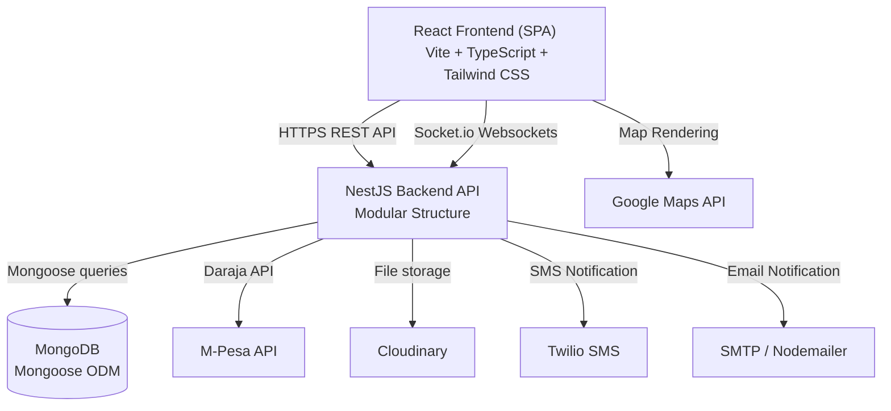

# LegalPro - System Functionality & Technical Implementation Manual

This document provides a comprehensive technical overview and architecture description of **LegalPro v1.0.1** (Advocate Case Management System). It covers system architecture, database models, directory structures, backend/frontend implementations, integrations, and step-by-step business workflows.

---

## 1. 🏗️ High-Level System Architecture

LegalPro follows a classic client-server architecture built on a modern JavaScript/TypeScript stack:



### Key Architectural Highlights:
1. **Frontend (Client)**: Single Page Application (SPA) driven by React, compiled via Vite, and styled dynamically with Tailwind CSS. Incorporates custom animations using Framer Motion.
2. **Backend (Server)**: A modular NestJS API incorporating dependency injection, strict DTO validation, structured logging interceptors, role-based guards, and an automated Swagger API engine.
3. **Database (Persistence)**: MongoDB Atlas cluster mapped using Mongoose ODM schemas with virtuals and custom hooks.

---

## 2. 🗄️ Database Schema & Data Models

### 👤 User Model
Manages user accounts, authorization roles, admin permissions, and advocate-specific professional records.
- **Fields**:
  - `firstName` & `lastName`: String (required, max 50 characters)
  - `email`: String (required, unique, lowcase, validated)
  - `password`: String (required, hashed using `bcrypt` with salt rounds = 10)
  - `role`: String (enum: `['admin', 'advocate', 'client']`, default: `'client'`)
  - `phone`: String (optional, E.164 format validation)
  - `avatar`: String (optional url)
  - `isVerified`: Boolean (default `false`; applies to advocates and general email validation)
  - **Advocate-specific Details** (nested):
    - `licenseNumber`: String (required if role is `'advocate'`)
    - `specialization`: Array of Strings (e.g., Family Law, Commercial Law)
    - `experience`: Number (years)
    - `education`: String
    - `barAdmission`: String
  - **Permissions Matrix** (nested under `permissions`):
    - `canOpenFiles`, `canUploadFiles`, `canAdmitClients`, `canManageCases`, `canScheduleAppointments`, `canAccessReports` (Booleans)
  - **Metadata**: `createdBy` (Ref to User), `isActive` (Boolean), `lastLogin` (Date)

### 📂 Case Model
Represents a legal case, document attachments, activity timelines, and progress tracking.
- **Fields**:
  - `caseNumber`: String (unique, auto-generated e.g., `LP-2026-XXXX`)
  - `title`: String (required, max 200 characters)
  - `description`: String (required)
  - `category`: String (enum matching Legal Practice Areas)
  - `status`: String (enum: `['pending', 'in_progress', 'completed', 'closed']`, default: `'pending'`)
  - `priority`: String (enum: `['low', 'medium', 'high', 'urgent']`, default: `'medium'`)
  - `clientId`: ObjectId (Ref to User, required)
  - `assignedTo`: ObjectId (Ref to User, optional - points to an Advocate)
  - `courtDate`: Date (optional)
  - **Nested Documents Array**:
    - `name` (String), `type` (String), `size` (Number), `url` (String - Cloudinary secure link), `uploadedBy` (Ref to User), `createdAt` (Date)
  - **Nested Notes Array**:
    - `content` (String), `author` (Ref to User), `isPrivate` (Boolean - visible to Advocate/Admin only), `createdAt` (Date)
  - **Nested Timeline Array**:
    - `event` (String), `description` (String), `performedBy` (Ref to User), `timestamp` (Date)

### 📅 Appointment Model
Manages consultation requests, meetings, fees, and event reminders.
- **Fields**:
  - `title`: String (required)
  - `description`: String (optional)
  - `date`: Date (required)
  - `time`: String (required, e.g., `14:30`)
  - `duration`: Number (minutes, e.g., `30`, `60`)
  - `status`: String (enum: `['scheduled', 'confirmed', 'completed', 'cancelled']`, default: `'scheduled'`)
  - `type`: String (enum: `['consultation', 'follow_up', 'court_appearance']`, default: `'consultation'`)
  - `clientId`: ObjectId (Ref to User, required)
  - `advocateId`: ObjectId (Ref to User, required)
  - `location`: String (optional physical location or virtual URL)
  - `meetingLink`: String (optional Zoom/Teams link)
  - `fee`: Number (optional)
  - `paymentStatus`: String (enum: `['pending', 'paid', 'failed']`, default: `'pending'`)

### 💳 Payment & Transaction Model
Tracks M-Pesa mobile transactions, audit trails, and B2C refunds.
- **Fields**:
  - `transactionId`: String (unique checkout request or receipt ID)
  - `amount`: Number (required)
  - `phone`: String (M-Pesa payment phone number)
  - `paymentType`: String (enum: `['consultation_fee', 'retainer', 'document_fee', 'other']`)
  - `status`: String (enum: `['pending', 'completed', 'failed', 'refunded']`, default: `'pending'`)
  - `userId`: ObjectId (Ref to User, required)
  - `appointmentId`: ObjectId (Ref to Appointment, optional)
  - `mpesaReceiptNumber`: String (returned by Daraja on success)
  - `errorMessage`: String (if failed)
  - `refundedAt`: Date, `refundTransactionId`: String

---

## 3. 🚀 Backend Implementation Details (NestJS)

The NestJS backend in `backend/src/` is built around modern software patterns:

### A. Root Configuration (`main.ts` & `app.module.ts`)
- **Global Pipes**: Uses `ValidationPipe` with `{ whitelist: true, forbidNonWhitelisted: true, transform: true }` to enforce strict schema types and scrub unmapped properties.
- **Security Middleware**: Sets up safe CORS origins (including configurable localhost and production client URLs) and binds security layers (Helmet headers, rate-limiting, and sanitized inputs).
- **Exceptions Filter**: `AllExceptionsFilter` catches all HTTP and system errors globally, formatting them into standardized, clean JSON responses (`{ success: false, message, statusCode, timestamp }`).

### B. Core Modules
1. **Auth Module (`auth/`)**:
   - Handles password hashing via `bcrypt` and validation.
   - Issues JSON Web Tokens (JWT) signed with `JWT_SECRET`.
   - Utilizes `JwtStrategy` (Passport-JWT) to parse headers and construct `req.user` contexts.
2. **Users Module (`users/`)**:
   - Manages CRUD operations for User profiles.
   - Enforces administrative controls for role management and advocate verification via custom NestJS guards (`RolesGuard`).
3. **Health Module (`health/`)**:
   - Implements `/api/health` and `/api/readiness` endpoints.
   - Dynamically checks memory consumption, process uptime, and database connection state to feed status updates.

### C. Global Interceptors
- **`LoggingInterceptor`**: Records inbound HTTP methods, request latency, and outcomes using NestJS custom log formatters.
- **`TransformInterceptor`**: Normalizes all outbound success responses into a clean envelope: `{ success: true, data: [...] }`.
- **`RateLimitInterceptor`**: Limits repeated requests in short periods to defend against DDoS or brute-force queries.

---

## 4. 🎨 Frontend Implementation Details (React + TS)

The React frontend in `src/` leverages structural isolation and hook-driven states:

### A. Modular Structure
- **`/components`**: Reusable generic blocks:
  - **`Layout/`**: Navigation bars, custom footers, and dashboard frames dynamically toggled by auth state.
  - **`ui/`**: Base design blocks (`Button.tsx`, `Card.tsx`, `Input.tsx`) built using `clsx` tailwind mergers and `forwardRef` elements.
  - **`payments/`**: Structured checkout screens containing live status checking indicators for M-Pesa Daraja STK Push requests.
- **`/pages`**: Dedicated full-screen views (e.g., `Home.tsx`, `Dashboard.tsx`, `Cases.tsx`, `Appointments.tsx`, `Messages.tsx`, `AdminManagement.tsx`).
- **`/contexts`**: `AuthContext.tsx` handles JWT storage, user permissions, and persistent authentication sessions.
- **`/hooks`**: Custom wrappers like `useApi.ts` managing Axios lifecycle, request triggers, dynamic loads, and local error handling.

### B. Dynamic Animations & Styles
- **Framer Motion**: Smooth entry/exit animations, hover transformations, card flips, and interactive wizard steps.
- **Tailwind CSS**: Core layout parameters configured in `tailwind.config.js` including specific fonts (Outfit, Inter) and an HSL color framework mapping primary, secondary, background, and alert colors.

---

## 5. 🔌 Third-Party Integrations

### 💳 1. M-Pesa Daraja API Payment Integration
Integrated within `backend/` to handle client mobile billing in Kenya:
- **STK Push (Lipa Na M-Pesa Online)**:
  1. Frontend sends phone and amount to `/api/payments/stk-push`.
  2. Backend requests an OAuth2 token from Safaricom, compiles a password digest (`Shortcode + Passkey + Timestamp`), and fires a POST request to Safaricom Daraja API.
  3. Customer receives a prompt to enter their M-Pesa PIN.
- **Callback Processing**:
  - Safaricom calls `/api/payments/mpesa/stk-callback` asynchronously.
  - Backend parses the JSON body (checks `ResultCode`), extracts transaction parameters (receipt number, phone, amount), and updates the corresponding M-Pesa payment record.
- **Admin B2C Refunds**:
  - Allows verified admins to issue partial/full refunds back to a client's mobile wallet.

### ☁️ 2. Cloudinary File Storage
Handles case-related attachments, evidence files, and user avatars:
- Backend utilizes signed upload profiles to control file formats and prevent unauthenticated uploads.
- Custom prefixes (`legalpro/`) and size limits are verified on the fly.
- Image URLs are served dynamically with optimization configurations (`f_auto, q_auto`).

### 📧 3. Nodemailer & 📱 Twilio Integrations
Supports unified client messaging and alerts:
- **Nodemailer**: Connects via SMTP using secure protocols (TLS) to send appointment booking notifications, payment receipts, password reset links, and registration confirmation messages.
- **Twilio SMS**: Sends high-priority SMS alerts for immediate events, such as court date changes or emergency consultation cancellations.

---

## 6. 🔄 Key Business Workflows

### 🔐 A. Registration & Verification Workflow
```
[Client/Advocate User] 
       │
       ▼
   Register Form ──► Verification Check ──► [Password Hash & User Creation]
                         │
        ┌────────────────┴──────────────┐
        ▼                               ▼
    [Client Role]                [Advocate Role]
    Active immediately           Flagged isVerified = false
                                 Requires admin license review 
                                 to activate advocate privileges
```

### 📅 B. Appointment Booking & M-Pesa STK Flow
```
[Client] ──► Select Date/Time ──► Click Pay ──► [Initiate STK Push Request]
                                                     │
                                                     ▼
                                            [PIN Prompt on Phone]
                                                     │
                                                     ▼
                                            [Safaricom Callback]
                                                     │
                                                     ▼
                                      Status Updated (Paid) ──► Confirm Slot
```

### 📁 C. Case Document Lifecycle
1. **Upload**: Advocate triggers document upload. Frontend handles basic constraints (size < 50MB, legal formats).
2. **Transfer**: Backend routes the file stream safely into Cloudinary's secure container.
3. **Save**: The resulting URL and type details are saved into the `Case.documents` subdocument array, updating the case timeline automatically.
4. **Audit**: Timeline logs record which user uploaded the document.
